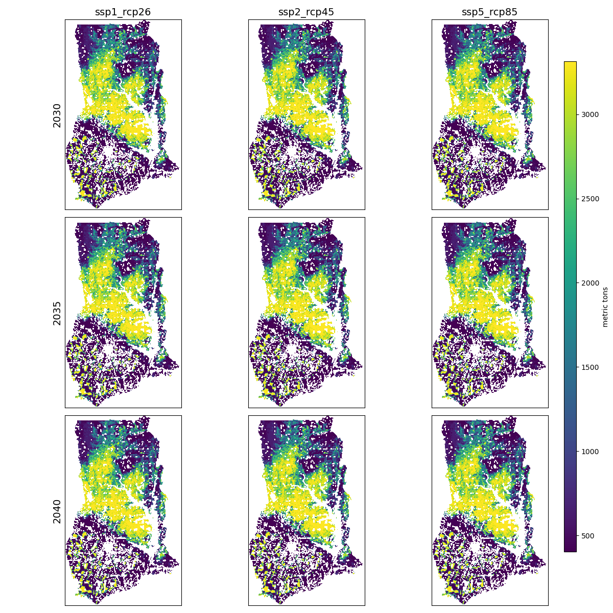

# Earth Economy Modeling for APEC 8601: Natural Resource Economics

#### Country: Ghana
#### Scenarios: SSP1-RCP2.6, SSP2-RCP4.5, SSP5-RCP8.5
#### Policy: Prevent expansion of cropland into forest

## SEALS 

Use the Spatial Economic Allocation Landscape Simulator (SEALS) to model land-use change and generate LULC maps for 2030, 2035, and 2040 under different Shared Socioeconomic Pathway (SSP) and Representative Concentration Pathways (RCP) scenarios.

### Scenarios

- Scenario 1:
    - SSP1: Sustainability – Taking the Green Road (Low challenges to mitigation and adaptation)
    - RCP2.6: Least amount of climate forcing
- Scenario 2:  
    - SSP2: Middle of the Road (Medium challenges to mitigation and adaptation)
    - RCP4.6: Low amount of climate forcing
- Scenario 3: 
    - SSP5: Fossil-fueled Development – Taking the Highway (High challenges to mitigation, low challenges to adaptation)
    - RCP8.5: Highest amount of climate forcing

##### Description

From the plots, we can see how different Ghana's landscape may look depending on the given scenario. In all cases, the urban area appears to expand, reflecting the country's place as a developing country. However, the largest difference is the decrease in forest and grassland, with large portions remaining in the southwest in SSP1-RCP2.6 and SSP2-RCP4.5, while it has been virtually completely replaced by cropland in SSP5-RCP8.5. 

### Scenarios under Policy

Suppose Ghana, in an effort to end deforestation, implements a policy that prevents any cropland expansion into forest land. 

##### Description

Now, we can observe how a strict anti-deforestation policy may change land-use trends under the various scenarios. In stark contrast to the previous maps, SSP5-RCP8.5 no longer exhibits a large decrease in forest. Grassland still appears to encroach into the forest in the central part of the country, but to a much lesser degree. The policy appears to have a much smaller impact in SSP1-RCP2.6 and SSP2-RCP4.5, where deforestation is driving much less of the land-use change. 

## InVEST

Based on the LULC maps generated by SEALS under the policy, use InVEST to forecast ecosystem service provision for carbon storage, annual water yield, pollination, sediment retention, and nutrient retention. 

### Carbon Storage

### Annual Water Yield

### Pollination

### Sediment Retention

### Nutrient Retention

##### Description

Since the policy is effective at preventing primary areas of deforestation in SSP5-RCP8.5, the ecosystem service provision is relatively consistent across the scenarios. There may be small areas of gains, but at the country level, it appears that preventing cropland expansion into forested areas is key to maintaining a consistent level of ecosystem service provision, even under more dire scenarios. The provision is also fairly consistent across the ecosystem services, which indicates that forests are a key driver of the value of ecosystem services. 

## Executive Summary

Ghana has the opportunity to foster sustainable development without sacrificing critical natural resources. While the future global climate is uncontrollable at a country level, policies can be implemented to ensure that development does not degrade the environment. Even in the era of 'Fossil-fueled Development,' preventing cropland expansion into forest land ensures that ecosystem system provision is guaranteed for future generations. Preventing development in the most environmentally valuable areas enables "green economic development" to succeed. 

## Technical Details

### Setup

This project requires a proper installation of the earth_economy_devstack and associated project directory and data directory. Visit the [SEALS repository](https://github.com/jandrewjohnson/seals) for more information.

### Basic Outline

1. Baseline SEALS

    For a new standard SEALS run, several modifications must be made. `scenario_definitions.csv` must be updated to reflect the desired years, AOI (iso3 country code), SSP-RCP scenarios ([Land Use Harmonization data](https://luh.umd.edu/data.shtml)). Create a new project folder and change `project_name = 'country_standard'` in `run_test_standard.py`. 

    - `run_seals_ghana_standard.py`

2. Policy SEALS

    To run SEALS with a new policy applied, `default_global_coefficients.csv` must be updated to reflect how the policy will impact land use change. For example, to prevent cropland expansion into forest, change the multiplicative coefficient `forest_constraint=0` for `cropland`. It is also possible to add a new raster layer to effect land use change. 

    - `run_seals_ghana_policy.py`

3. InVEST models

    The SEALS LULC maps can be used as the primary input to model ecosystem services using InVEST. In addition to LULC data, the models require other global input data for each process based model. The input data may need to processed before running InVEST, including reprojecting and clipping. 

    - `process_invest_inputs.py`
    - `run_invest_ghana_policy.py`

4. Visualization

    After running SEALS and InVEST, the maps may be visualized to explore the results. 

    - `seals_plot.py`
    - `invest_plot.py`

### Other Projects

In addition to this project, I developed other code for APEC 8601: Natural Resource Economics. 

- [Problem Set 1](problem_sets/apec8601_mbraak_ps1.pdf): Dynamic optimization
- [Problem Set 2](problem_sets/problem_set_2_v2_mbraak.ipynb): DICE and MAGICC model
- [Problem Set 3](problem_sets/apec8601_mbraak_ps3.pdf): Dynamic optimization
- [Problem Set 4](problem_sets/apec8601_mbraak_ps4.pdf): InVEST Scenic Quality model
