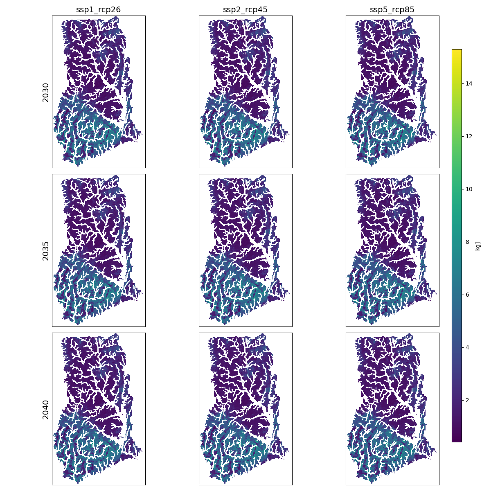

# Earth Economy Modeling for APEC 8601: Natural Resource Economics

### Country: Ghana
### Executive Summary

## SEALS 

### Baseline

### Scenarios

### Scenarios under Policy

### Narrative Description

## InVEST

### Carbon Storage

### Annual Water Yield

### Pollination

### Sediment Retention

### Nutrient Retention

### Narrative Description

## Technical Details

### Setup

### Other Projects

### More from APEC 8601