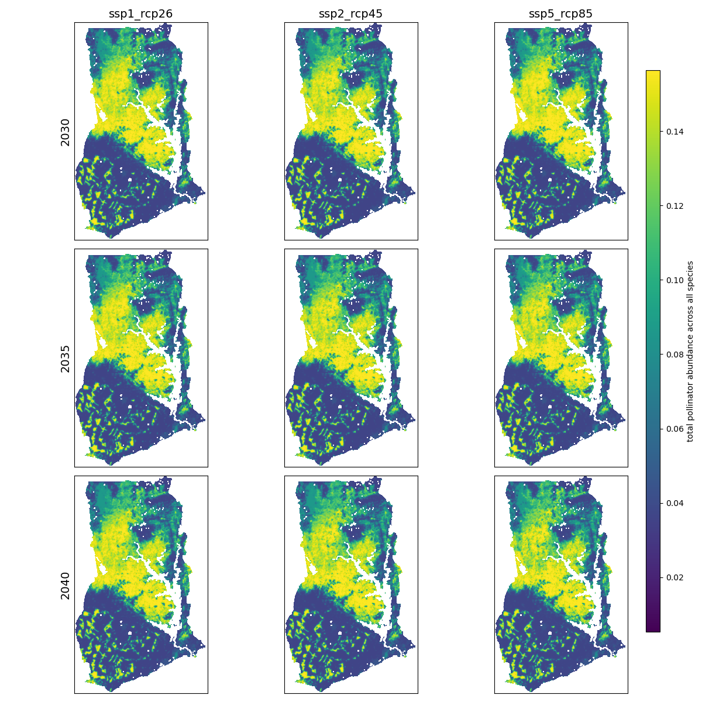

# Earth Economy Modeling for APEC 8601: Natural Resource Economics

### Country: Ghana
### Executive Summary

## SEALS 

### Baseline

### Scenarios

|      | ssp1_rcp26 | ssp2_rcp45 | ssp5_rcp85 |
| ---- | ---------- | ---------- | ---------- |
| 2030 | link       | link       | link       |
| 2035 | link       | link       | link       |
| 2040 | link       | link       | link       |

### Scenarios under Policy

|      | ssp1_rcp26 | ssp2_rcp45 | ssp5_rcp85 |
| ---- | ---------- | ---------- | ---------- |
| 2030 | link       | link       | link       |
| 2035 | link       | link       | link       |
| 2040 | link       | link       | link       |

### Narrative Description

## InVEST

### Carbon Storage

### Annual Water Yield

### Pollination

### Sediment Retention

### Nutrient Retention

### Narrative Description

## Technical Details

### Setup

### Other Projects

### More from APEC 8601